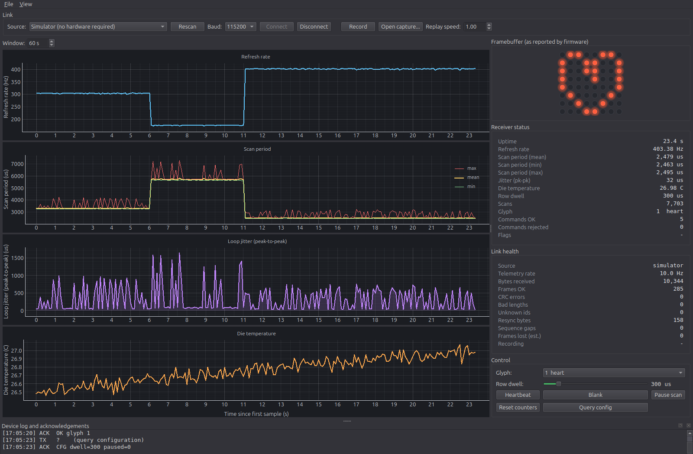

# vmoji-pico
Volumetric Display for the Raspberry Pi Pico (RP2040).

## Telemetry dashboard

The firmware streams binary telemetry at 10 Hz - measured scan rate, per-scan
jitter, die temperature and the live framebuffer - to a PySide6 desktop
dashboard that plots it in real time, logs it, and can replay a recording.

See [tools/dashboard/README.md](tools/dashboard/README.md).



The dashboard also runs against a built-in simulator, so no hardware is needed to
try it:

```bash
cd tools/dashboard
python3 -m venv .venv && .venv/bin/pip install -r requirements.txt
.venv/bin/python app.py
```

## Dev Env Setup

We use the "Raspberry Pi Pico Project" extension in VS Code with a Linux PC.  
With it, you can prepare the environment (install the "pico-sdk" SDK locally).  

This [PDF guide](https://pip-assets.raspberrypi.com/categories/610-raspberry-pi-pico/documents/RP-008276-DS-1-getting-started-with-pico.pdf?disposition=inline) explains very well what to do.

To let it run properly the commands it needs without any permission issue (without needing to always write `sudo`),
the `/etc/udev/rules.d/99-picotool.rules` file was created with the following content:
`SUBSYSTEM=="usb", ATTR{idVendor}=="2e8a", MODE="0666"`  

After, reload the rules:  
`sudo udevadm control --reload-rules`  
`sudo udevadm trigger`  

For cross-debugging, make sure you installed the appropriate tools:

`sudo apt update`  
`sudo apt install gdb-multiarch binutils-multiarch gcc-arm-none-eabi`  


## Quick Start (VS Code)

### Building
From the extension, you can click "Compile Project".  

### Flashing by Copy/Paste
If not in bootloader mode already, reconnect the Raspberry Pi Pico while pressing down on the bootloader button.  
You should now see it as a "USB device" in your file explorer.  
Copy/paste the build .uf2 output file into that USB device to flash the device.

The device will restart automatically and run the program you flashed.

### Flashing via SWD
Using the debug probe, you can flash quickly via SWD. See the guide for detailed instructions.  
This way you don't need to unplug and re-plug the raspberry pi each time, which is convenient.  


